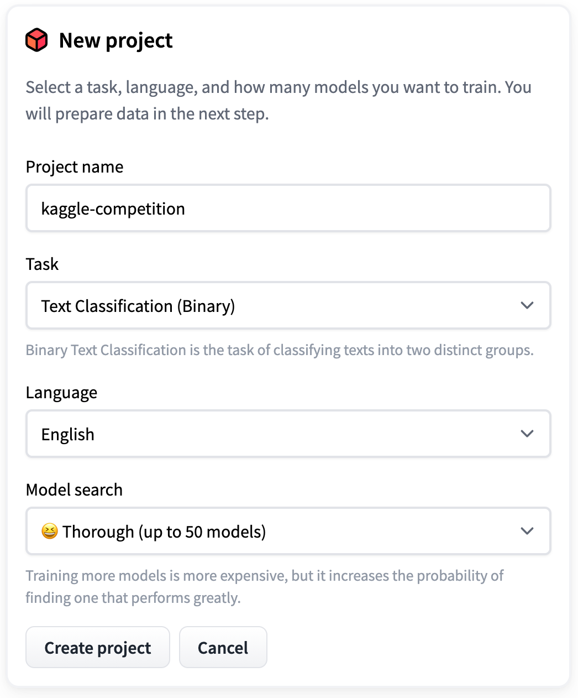
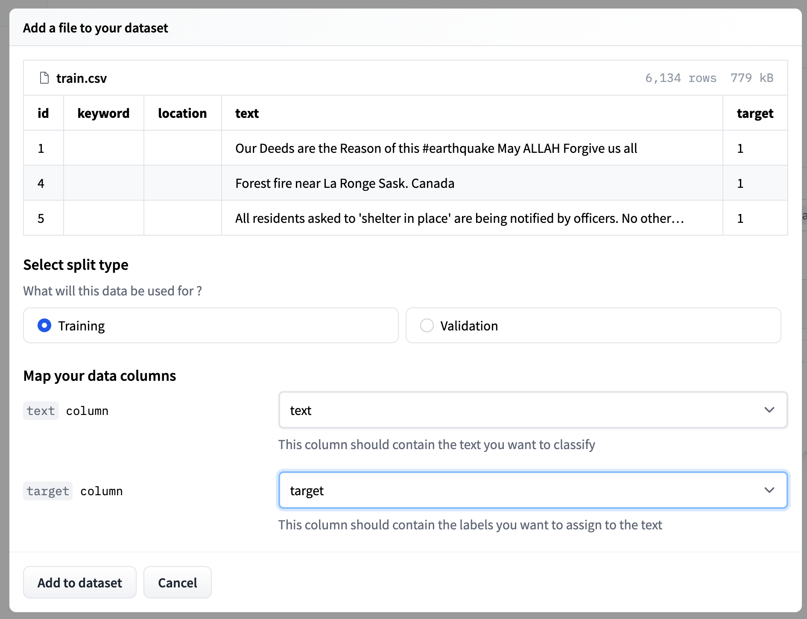
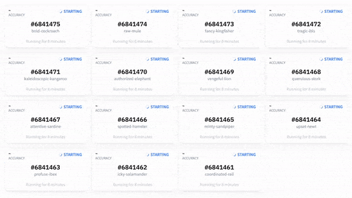
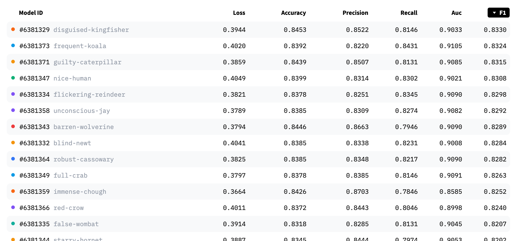
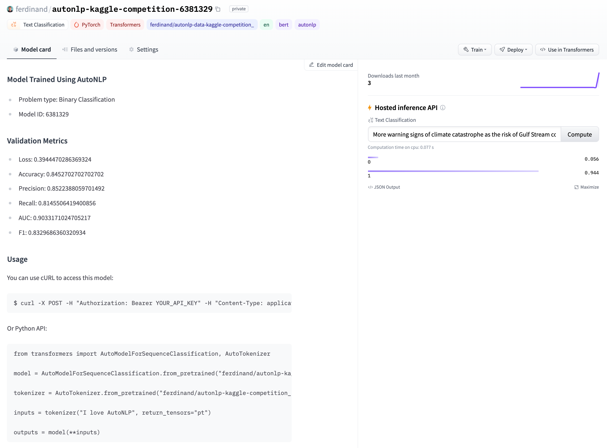
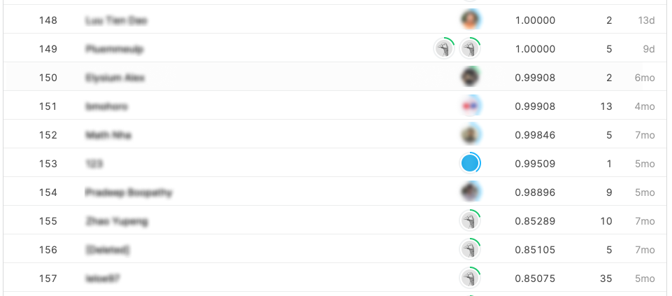

# How to beat the best in an NLP competition without any Machine Learning

<div class="blog-metadata">
    <small>Published August 6, 2021</small>
    <a target="_blank" class="btn no-underline text-sm mb-5 font-sans" href="https://github.com/huggingface/blog/blob/master/kaggle-competition-without-nlp.md">
        Update on GitHub
    </a>
</div>

<div class="author-card">
    <a href="/ferdinandboas05">
        
        <div class="bfc">
            <span class="fullname">Ferdinand Boas</span>
        </div>
    </a>
</div>

_Find all the scripts and assets mentioned in this article in [this GitHub repository](https://github.com/ferdi05/kaggle-disaster-tweet-competition)._

One of the cool things about Machine Learning is that you can see it as a competition. Your models can be evaluated with many performance indicators, and be ranked on various leaderboards. You can compete against other Machine Learning practitioners around the world, and your competitors can be a student in Malaysia or the largest AI lab at Stanford University.<br />
[Kaggle](https://www.kaggle.com/) started as a platform to host such Machine Learning contests, and it gained a lot of attention from the data science community. The best data scientists exhibit on Kaggle their most sophisticated Machine Learning skills, craft the most elaborated models to reign over these competitions.
Kaggle is now a broader platform, where you can enter these competitions but also learn data science, discuss it, and collaborate with other Machine Learning practitioners.

Most of the Kaggle competitors are Machine Learning practitioners. Many software engineers do not enter these competitions, mostly because they think that they do not have the needed skill set, tools or time to be successful in them.

Machine Learning can be hard to learn and use. It’s a very technical field.<br />
A typical Machine Learning project involves quite some complexity: you will have to choose or train a model that suits your needs, fine-tune it for your own curated dataset, and deploy the model in a production environment. You will also need to worry about monitoring, scalability, latency, reliability, performances...<br />
This is usually a resource-intensive process, it takes time, knowledge, compute resources and money. _This does not fit well with the regular activities of a software engineer._

**Now is the time when you wonder how to rank among the best data scientists in Kaggle Natural Language Processing (NLP) challenges without using any Machine Learning.**<br />
This blog post explains how you can successively leverage 🤗 AutoNLP web interface and 🤗 Inference API to achieve this result.

1. [The Kaggle competition](#the-kaggle-competition)
2. [🤗 AutoNLP web interface to the rescue](#🤗-autonlp-web-interface-to-the-rescue)
    1. [What is 🤗 AutoNLP?](#what-is-🤗-autonlp)
    2. [Training Machine Learning models with data only](#training-machine-learning-models-with-data-only)
3. [Solving the Kaggle challenge with the 🤗 Inference API](#solving-the-kaggle-challenge-with-the-🤗-inference-api)
    1. [Serving Machine Learning models with the 🤗 Inference API](#serving-machine-learning-models-with-the-🤗-inference-api)
    2. [A few API calls to solve the challenge](#a-few-api-calls-to-solve-the-challenge)
4. [Do more with the AutoNLP Python package](#do-more-with-the-autonlp-python-package)

## The Kaggle competition

Entering a Kaggle competition is straightforward. You are asked to perform a task such as [sentiment analysis](https://en.wikipedia.org/wiki/Sentiment_analysis) or [object detection](https://en.wikipedia.org/wiki/Object_detection) that can be solved with Machine Learning. Kaggle provides a  training dataset with examples of the task to achieve. You can use this dataset to train a Machine Learning model. Then you can use this model to perform the same task on a test dataset (also provided by Kaggle). This is your attempt at solving the challenge. Then you will submit your model predictions for this test dataset to Kaggle and they will evaluate it and give you a ranking in the competition that you entered.

You will find plenty of NLP competitions on the Kaggle website. This blog post shows how to participate in the [Natural Language Processing with Disaster Tweets](https://www.kaggle.com/c/nlp-getting-started/) competition as it is quite recent (7 months when writing this post) and has over 3,000 submissions from other teams.
This competition challenges you to build a Machine Learning model that predicts if a tweet is about a real disaster or not.

<blockquote class="twitter-tweet tw-align-center" data-conversation="none"><p lang="en" dir="ltr"><a href="https://twitter.com/MarksMaponyane?ref_src=twsrc%5Etfw">@marksmaponyane</a> Hey!Sundowns were annihilated in their previous meeting with Celtic.Indeed its an improvement.</p>&mdash; Charlie Langa (@CharlieLanga) <a href="https://twitter.com/CharlieLanga/status/629010812728963072?ref_src=twsrc%5Etfw">August 5, 2015</a></blockquote> <script async src="https://platform.twitter.com/widgets.js" charset="utf-8"></script>

<div style="line-height:105%;font-size:80%">
    <p align="center">
    This tweet is not about a disaster
    </p>
</div>

Kaggle provides a [training](https://github.com/ferdi05/kaggle-disaster-tweet-competition/blob/main/assets/train_original.csv) dataset of around 7,500 tweets (the input object) with their associated label (the desired output value) telling if the tweets are about a disaster (label is 1) or not (label is 0). This dataset will be used to train a few Machine Learning models and evaluate them.


Kaggle also provides a [test](https://github.com/ferdi05/kaggle-disaster-tweet-competition/blob/main/assets/test.csv) dataset of around 3,200+ tweets without any paired label. We will use the newly created Machine Learning model to predict if they are about a disaster, asking the Machine Learning model to apply similar labels to each of these tweets by reproducing what it learnt from its training.


These datasets also contain two other data columns that will not be used: a keyword and a location of the tweet.

## 🤗 AutoNLP web interface to the rescue

The process of training a Machine Learning model is not straightforward. It requires collecting cleaning and formatting data, selecting a Machine Learning algorithm, playing with the algorithm parameters, training the model, evaluating its performance and iterating. And this does not guarantee good performances.<br />
This is a resource-intensive process. Fortunately you can use a web interface to do all the heavy-lifting and save hours of Machine Learning-induced head-scratching.

### What is 🤗 AutoNLP?

Leveraging its experience with the most performant architectures of NLP, [Hugging Face](/) offers the [🤗 AutoNLP web interface](https://ui.autonlp.huggingface.co/) to automatically train, evaluate and deploy state-of-the-art NLP models for different tasks. All you need to do is feed it your datasets.
🤗 AutoNLP will train a range of NLP models suitable for the task required by the competition, and will use a various set of configurations for each of them to achieve the best results. Then each model’s performances will be automatically evaluated. You will save a lot of resources and money by avoiding their computer-intensive training.
Later the most performant model will be selected to make predictions for the Kaggle competition.

🤗 AutoNLP uses [supervised learning algorithms](https://machinelearningmastery.com/supervised-and-unsupervised-machine-learning-algorithms/) to train the candidate Machine Learning models. This means that these models will try to reproduce what they learnt from examples that pair an input object and its desired output value. After their training, these models should successfully pair unseen input objects with their correct output values.

### Training Machine Learning models with data only

The competition asks to label each tweet as related to a disaster or not. Binary [text classification](https://monkeylearn.com/text-classification/) is one of the tasks that you can achieve with the 🤗 AutoNLP web interface.



In this competition, Kaggle provides only one training dataset but you need one dataset to train the models (the training dataset) and another one (the validation dataset) to evaluate their performances.<br />
The original dataset provided by Kaggle will be split into 2 datasets using a rule of thumb ratio of 80%-20%.



The columns of both datasets need to be mapped. The text column is the input object and the target column is the desired output value. Here the input object is a tweet content, and the output value is 1 if the tweet is about a disaster, otherwise it’s 0.

Then the web interface starts the training and does its magic.



After a few minutes, models are trained, evaluated and uploaded on the [Hugging Face Hub](https://huggingface.co/models) (with private visibility). They are ready to serve, still without any Machine Learning instructions!

For this competition, Kaggle will evaluate performance of the predictions with their F1 score. So the best model will be the one with the highest F1 score.



Kaggle sometimes evaluates your results with more sophisticated metrics. Conveniently 🤗 AutoNLP web interface automatically uploads each trained models files on the Hugging Face Hub and [their associated card](https://huggingface.co/ferdinand/autonlp-kaggle-competition-6381329) which includes the model metrics (that you may combine according to you need) and code snippets to use the model. And there is even a widget to quickly experiment with the model.



## Solving the Kaggle challenge with the 🤗 Inference API

It is now time to use the most performant model with the test dataset provided by Kaggle.
There are two different ways to use the model:
1. the data scientist way: deploying the model on a dedicated infrastructure or on a Machine Learning platform
1. the _developer-friendly_ way of using it: through API calls. This is the one described here.

### Serving Machine Learning models with the 🤗 Inference API
Using Machine Learning models in production is hard, even for Machine Learning engineers:
* you may have a difficult time handling large and complex models
* your tech architecture can be unoptimized
* your hardware may not meet your requirements

Your model may not have the scalability, reliability or speed performances that you were expecting.<br />
Fortunately you can rely on the [🤗 Inference API](https://huggingface.co/inference-api) to use your model, still without coding any Machine Learning. The API allows you to reach up to [100x speedup](https://huggingface.co/blog/accelerated-inference) compared to deploying your model locally or on a cloud, thanks to many optimisation techniques. And the API has built-in scalability which makes it a perfect addition to a software production workflow, while controlling the costs as you will not need any extra infrastructure resources.


### A few API calls to solve the challenge

Let’s call the 🤗 Inference API for each row of the test dataset, and write the output value in the submission file.<br />
You could use the API via regular HTTP calls, but there is an alternate way: the [huggingface_hub library](https://github.com/huggingface/huggingface_hub/) conveniently offers a wrapper client to handle these requests, and you can use it to call the API.

```python
import csv
from huggingface_hub.inference_api import InferenceApi

inference = InferenceApi("ferdinand/autonlp-kaggle-competition-6381329", token=API_TOKEN) # URL of our model with our API token
MODEL_MAX_LENGTH = 512 # parameter of our model, can be seen in config.json at "max_position_embeddings"

fr = open("assets/test.csv") # Kaggle test data
csv_read = csv.reader(fr)
next(csv_read) # skipping the header row

fw = open("assets/submission.csv", "w", encoding="UTF8") # our predictions data
csv_write = csv.writer(fw)
csv_write.writerow(['id', 'target']) # writing the header row

#returns a label : about a disaster or not given a tweet content
def run(tweet_content):

    # calling the API, payload is the tweet content , possibly truncated to meet our model requirements
    answer = inference(inputs=tweet_content[:MODEL_MAX_LENGTH])

    # Determining which label to return according to the prediction with the highest score
    # example of an API call response: [[{'label': '0', 'score': 0.9159180521965027}, {'label': '1', 'score': 0.08408192545175552}]]
    max_score = 0
    max_label = None 
    for dic in answer[0]:
        for label in dic['label']:
            score = dic['score']
            if score > max_score:
                max_score = score
                max_label = label
    return max_label


for row in csv_read: # call the API for each row

    # writing in the submission file the tweet ID and its associated label: about a disaster or not
    write_row = [row[0], run(row[3])] # row[0] is the tweet ID, row[3] is the tweet content
    csv_write.writerow(write_row)
```

After running the 🤗 Inference API on all the input data (it may take a while), you will end up with a file that you can submit to Kaggle for evaluation.


This model made it to the top 15% of the competitors with a 0.83 mean score!<br />
At first you may be surprised to not rank higher. Unfortunately the test dataset and its associated label used for this competition are available publicly. So a few clever contestants submitted it and received an approximate 1.00 score, which is not something realistic in a data science problem.



Having a second look at the leaderboard, you can see that the best data science teams have a 0.85 score. This is very close to the score obtained, and another 🤗AutoNLP test may give you similar results, depending on how lucky you are with the random variations of each model’s parameters. Given the time and resources invested in solving this challenge, this is almost a win!

## Do more with the AutoNLP Python package

With the 🤗 AutoNLP web interface, the 🤗 Inference API and a very few lines of code, NLP models were automatically created, deployed and used to achieve a great ranking in a NLP competition without learning or using any Machine Learning techniques.

🤗 AutoNLP can also be used as a Python package and can support more tasks than those provided by the web interface - but the interface is quickly catching up. You can use the package to perform tasks like speech recognition and enter even more Kaggle competitions!

If you want to win a Kaggle competition or simply to train a model for your business, you can get started with AutoNLP [here](/autonlp).